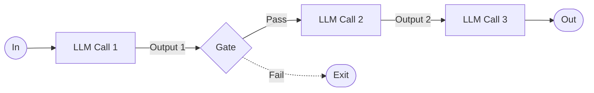
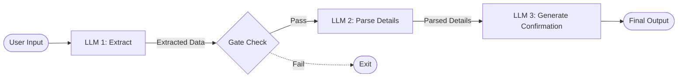
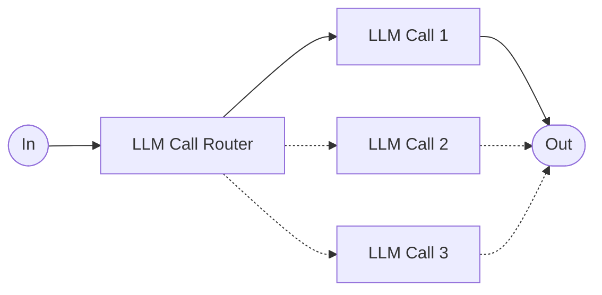
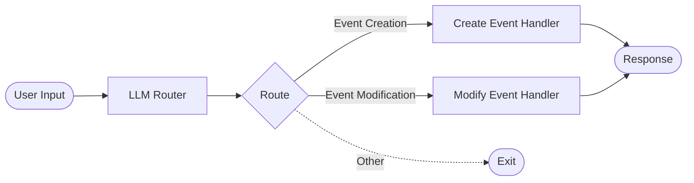
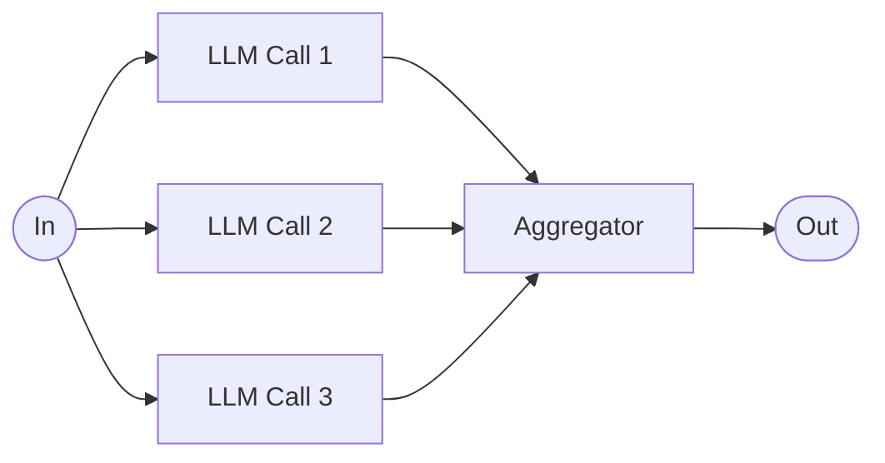
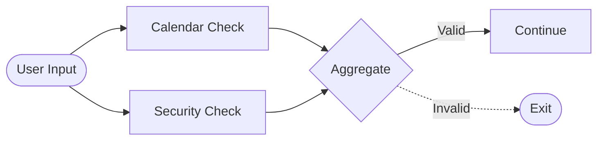
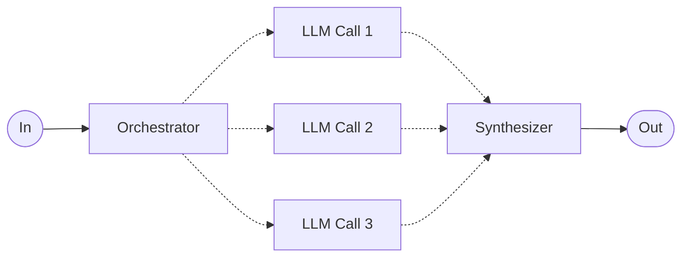
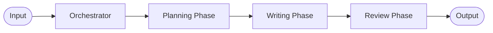

# ai-agents-in-pure-python <!-- omit in toc -->

This repository contains practical patterns and examples for building effective LLM-powered systems. Based on real-world implementations and lessons learned from working with production systems, these patterns focus on simplicity and composability rather than complex frameworks.

Whether you are building autonomous agents or structured workflows, you'll find proven patterns that can be implemented with just a few lines of code. Each pattern is illustrated with practical examples and diagrams to help you understand when and how to apply them effectively.

Learn more about the theory and practice behind these patterns:
- [Building Effective Agents](https://www.anthropic.com/research/building-effective-agents) - Anthropic's blog post
- [Practical LLM Patterns Video Guide](https://youtu.be/tx5OapbK-8A&t=0s) - Video walkthrough of key concepts by Dave Ebbelaar
    - workflows (predefined paths) vs agents (dynamic paths)
    - building block: the augmented LLM $\rightarrow$ the LLM with retrieval, tools, and memory
    - workflow: prompt chaining, routing, parallelization, orchestration
    - be careful with agents frameworks, prioritize deterministic workflows, do not underestimate scaling, your AI system needs evaluations

---

Table of Contents

- [1. Building block: The augmented LLM](#1-building-block-the-augmented-llm)
  - [1.1. Basic LLM calls](#11-basic-llm-calls)
  - [1.2. Structured output](#12-structured-output)
  - [1.3. Tools use](#13-tools-use)
  - [1.4. Retrieval](#14-retrieval)
- [2. Workflow patterns to build AI systems](#2-workflow-patterns-to-build-ai-systems)
  - [2.1. Prompt Chaining](#21-prompt-chaining)
  - [2.2. Routing](#22-routing)
  - [2.3. Parallelization](#23-parallelization)
  - [2.4. Orchestrator](#24-orchestrator)

---

# 1. Building block: The augmented LLM

## 1.1. Basic LLM calls

Basic LLM calls involve sending a text prompt directly to a large language model (LLM) and receiving a generated text response, leveraging the model's pre-trained knowledge without additional enhancements.

## 1.2. Structured output

Structured output refers to techniques that constrain an LLM's response to a predefined format, such as JSON, often achieved through specialized prompting, fine-tuning, or model-specific features to ensure parseable and consistent results.

## 1.3. Tools use

Tools use enables an LLM to interact with external functions or APIs by generating calls to these tools within its reasoning process, allowing it to access real-time data, perform computations, or execute actions beyond its internal knowledge.

## 1.4. Retrieval

Retrieval involves augmenting an LLM with external knowledge by querying a database or vector store to fetch relevant documents or information, which is then incorporated into the prompt for more accurate and contextually informed responses, as seen in retrieval-augmented generation (RAG) systems.

# 2. Workflow patterns to build AI systems

## 2.1. Prompt Chaining

Prompt chaining is a powerful pattern that breaks down complex AI tasks into a sequence of smaller, more focused steps. Each step in the chain processes the output from the previous step, allowing for better control, validation, and reliability.

> Calendar Assistant Example

Our calendar assistant demonstrates a 3-step prompt chain with validation:

→ Step 1: Extract & Validate

- Determines if the input is actually a calendar request
- Provides a confidence score
- Acts as an initial filter to prevent processing invalid requests

→ Step 2: Parse Details

- Extracts specific calendar information
- Structures the data (date, time, participants, etc.)
- Converts natural language to structured data

→ Step 3: Generate Confirmation

- Creates a user-friendly confirmation message
- Optionally generates calendar links
- Provides the final user response

## 2.2. Routing

Routing is a pattern that directs different types of requests to specialized handlers. This allows for optimized processing of distinct request types while maintaining a clean separation of concerns.

> Calendar Assistant Example

Our calendar assistant demonstrates routing between event creation and event modification:

→ Router

- Classifies the request type (new/modify event)
- Provides confidence scoring
- Cleans and standardizes the input

→ Specialized Handlers

- Create Event Handler: Creates calendar events
- Modify Event Handler: Updates existing events
- Each optimized for its specific task

## 2.3. Parallelization

Parallelization runs multiple LLM calls concurrently to validate or analyze different aspects of a request simultaneously.

> Calendar Assistant Example

Our calendar assistant implements parallel validation guardrails:

→ Parallel Checks

- Calendar Validation: Verifies valid calendar request
- Security Check: Screens for prompt injection
- Run simultaneously for better performance

→ Aggregation

- Combines validation results
- Applies validation rules
- Makes final accept/reject decision

## 2.4. Orchestrator

The orchestrator-workers pattern uses a central LLM to dynamically analyze tasks, coordinate specialized workers, and synthesize their results. This creates a flexible system that can adapt to different types of requests while maintaining specialized processing.

> Blog Writing Example

This blog writing system demonstrates the orchestrator pattern for content creation:

→ Orchestrator

- Analyzes the blog topic and requirements
- Creates structured content plan
- Coordinates section writing
- Manages content flow and cohesion

→ Planning Phase

- Analyzes topic complexity
- Identifies target audience
- Breaks content into logical sections
- Assigns word count per section
- Defines writing style guidelines

→ Writing Phase

- Specialized workers write individual sections
- Each section maintains context from previous sections
- Follows style and length guidelines
- Captures key points for each section

→ Review Phase

- Evaluates overall cohesion
- Scores content flow (between 0 and 1)
- Suggests section-specific improvements
- Produces final polished version

